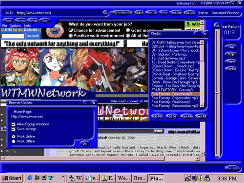



## WTMWVue Web Browser \(Fixed Errors\)

### Description

This is my best work yet, i have been working on this for about 3 months now, and its still beta 1. This browser has an MP3 player, an HTML editor, and the browser (duh) all in one. This is only Beta 1, so its not finished yet. I have been working very long and hard, and i think it is pretty good. The download is 680 kb, but its worth the download. Oh and by the way, i am going to release this program on my website where people can download it and use it, but it will be complete, so dont think about taking this and putting your name on it. I will get PO'd. I will only release beta 1 and beta 2 on this site, as i do not want the release version to be stolen. I have not gotten to beta 2 yet, but it will come out soon. Please vote for me, i would really appreciate it. If there are any errors you find, please post them in the comments, so i cant get farther along on the project. Thanks.
 
### More Info
 

             |
---                |---
**Submitted On**   |2000-12-01 22:38:56
**By**             |[Crash Overide](https://github.com/Planet-Source-Code/PSCIndex/blob/master/ByAuthor/crash-overide.md)
**Level**          |Beginner
**User Rating**    |4.8 (24 globes from 5 users)
**Compatibility**  |VB 5\.0, VB 6\.0
**Category**       |[Internet/ HTML](https://github.com/Planet-Source-Code/PSCIndex/blob/master/ByCategory/internet-html__1-34.md)
**World**          |[Visual Basic](https://github.com/Planet-Source-Code/PSCIndex/blob/master/ByWorld/visual-basic.md)
**Archive File**   |[CODE\_UPLOAD122581222000\.zip](https://github.com/Planet-Source-Code/crash-overide-wtmwvue-web-browser-fixed-errors__1-13255/archive/master.zip)

